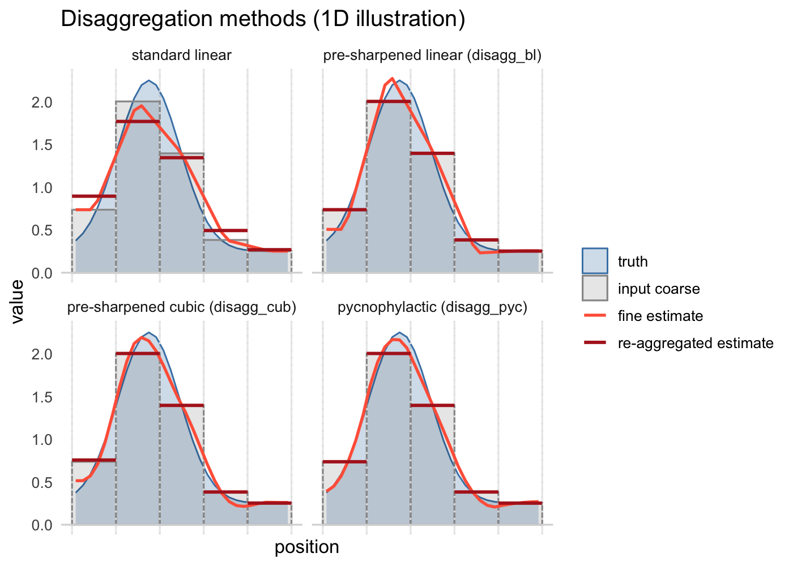

<!-- README.md is generated from README.Rmd. Please edit that file -->

# terraces

<!-- badges: start -->

<!-- badges: end -->

The **terraces** R package extends raster disaggregation methods from
**terra** to provide **A**ggregation-**C**onsistent **Es**timation
algorithms.

When we disaggregate a coarse raster, there are typically two things we
want from the fine-scale result: that it be consistent with the coarse
raster (re-aggregating it recovers the input), and that it be consistent
with the true fine-scale pattern underlying the coarse raster
(continuous, with smooth local variation). Standard disaggregation
methods sacrifice one goal or the other. `terraces` methods satisfy
both.

`terraces` provides three aggregation-consistent (mass-preserving)
disaggregation methods whose output, when re-aggregated, recovers the
original coarse values. They include bilinear and cubic variants of
*pre-sharpening* disaggregation (also known as prefiltering) as well as
an implementation of *pycnophylactic* interpolation (Tobler, 1979).

## Quick start

### Installation

``` r
# install.packages("pak")
pak::pak("matthewkling/terraces")
```

### Usage

``` r
library(terra)
library(terraces)

coarse <- rast(nrows = 100, ncols = 100, vals = runif(10000))

# standard bilinear -- treats coarse values as point samples
fine_std <- disagg(coarse, fact = 5, method = "bilinear")

# aggregation-consistent alternatives:
fine_bl  <- disagg_bl(coarse, fact = 5)
fine_cub <- disagg_cub(coarse, fact = 5)
fine_pyc <- disagg_pyc(coarse, fact = 5)
```

## When should I (not) use `terraces`?

Standard interpolation methods (`terra::disagg(method = "bilinear")` and
similar functions in other packages) implicitly assume that raster
values are point samples at cell centers. The terraces methods, by
contrast, treat them as averages over each cell’s area. Choose based on
what your data represent.

**Use `terraces`** when cell values represent averages over the area of
the cell. This is the typical case for most raster products:

- Coarsened DEMs (LiDAR aggregated to coarser resolution)
- Climate model output and reanalysis products (ERA5, CHELSA, WorldClim)
- Remote sensing products (radiance integrated over the pixel footprint)
- Gridded population counts and density rasters
- Any raster produced by `terra::aggregate(fun = "mean")` or equivalent

**Use standard bilinear disaggregation** in the less common case where
cell values represent point measurements at cell centers, with no
implied spatial extent. (Bilinear is the conventional choice for this
case, though it can’t recover extremes that fall between sample points.)

- Surfaces interpolated from sparse point data (kriging, IDW, splines)
- Point-based model output at grid cell centers
- Synthetic rasters generated by evaluating a continuous function at
  grid points
- Coarsened rasters where the coarsening was nearest-neighbor sampling

## Which `terraces` method should I use?

The package includes three disaggregation methods, all substantially
more accurate than standard bilinear on typical aggregated rasters. They
differ in how exactly they preserve coarse-cell means. **Pycnophylactic
interpolation** preserves them exactly, by construction. The
**pre-sharpening methods** are almost exactly mass-preserving, but do
contain tiny residual error resulting from using a finite-radius
approximation of an ideal infinite inverse kernel.

The methods are explained below, and

### Pre-sharpened bilinear: `disagg_bl()`

Use `disagg_bl()` when you want a fast, drop-in replacement for
`terra::disagg(method = "bilinear")` that’s aggregation-consistent. It
applies bilinear-style smoothness with a pre-sharpening filter on the
coarse raster, is non-iterative, and runs at similar speed to
`terra::disagg()`.

**How it works.** Standard bilinear interpolation, treated as a linear
operator “interpolate then aggregate,” acts as a small smoothing
convolution on the coarse grid. The package derives this smoothing
kernel analytically (a 3×3 stencil), inverts it by direct linear solve,
and applies the inverse as a single focal pass on the coarse raster
before standard `terra::disagg()`. The inverse kernel depends only on
the disagg factor; it’s computed once per factor and cached for the
session. This is structurally similar to prefilter-based B-spline
interpolation (Unser 1999), specialized to the case where the discrete
data are areal means rather than point samples.

### Pre-sharpened cubic: `disagg_cub()`

Use `disagg_cub()` for smoother output, when bilinear’s piecewise
structure is visually objectionable but you want a fast non-iterative
method. It applies Keys cubic convolution with a 5×5 pre-sharpening
kernel. The result is smoother than `disagg_bl()` (no kinks at cell
centers), but may overshoot near sharp gradients due to cubic’s negative
side lobes.

**How it works.** Mathematically identical to `disagg_bl()` but with a
5×5 round-trip kernel (cubic interpolates from a 4×4 neighborhood,
vs. 2×2 for bilinear). The package uses Keys cubic convolution with the
standard parameter `a = -0.5`, matching the convention in
`terra::resample(method = "cubic")` (verified empirically). Note that
`terra::disagg()` does not expose cubic interpolation directly, so
`disagg_cub()` uses `terra::resample()` internally for the final
interpolation step.

### Pycnophylactic interpolation: `disagg_pyc()`

Use `disagg_pyc()` when you want maximum smoothness. It implements
pycnophylactic interpolation (Tobler, 1979), adapted to regular raster
grids. The result is Laplacian-smooth (no kinks anywhere) and can be
more stable near sharp gradients than the pre-sharpening methods. The
algorithm is iterative and is typically substantially slower than the
pre-sharpening methods for large rasters.

**How it works.** Standard Tobler (1979) iteration on a regular grid:
start from a nearest-neighbor or bilinear disaggregation, repeatedly
smooth the fine raster with a 3×3 Laplacian kernel, then add a per-block
constant to restore each coarse block’s mean. Iterate until convergence.
By default, this iteration is cascaded through a sequence of smaller
stages — for example, disaggregating by `fact = 12` runs as three
sub-disaggregations at factors 3, 2, 2. When `fact` is large, cascading
is much faster than running a single iteration at the full `fact` and
can give smoother results.

## A visual comparison

Here’s a 1D illustration of standard linear interpolation versus the
three `terraces` methods. The three terraces methods are all
mass-preserving (aggregation-consistent), but differ in their
assumptions about within-block structure.



This depiction assumes that you start with a coarse input raster whose
cell values (gray bars) represent averages of a likely unknown
fine-scale pattern (blue curve). Each of the disaggreation methods
estimates a different fine-scale pattern (orange), which could in theory
be compared to the truth to assess accuracy. Re-aggregating the
fine-scale estimates to coarse-scale means (red) fails to recover the
input values for standard interpolation, but matches them closely for
the three mass-preserving methods.

## Edge effects

Pre-sharpened disaggregation has a boundary band where mass preservation
and smoothness are slightly degraded relative to the interior, resulting
from the focal pass’s reflective extension and terra’s own boundary
fallback for cubic and bilinear. For typical raster sizes this band is
minimal, but you can inspect it with `edge_effects()`, which returns a
fine-resolution mask of the affected zone. Use it to drop affected cells
from results when boundary reliability matters (e.g. small rasters,
mosaic tiling, or regions of interest near edges).

Pycnophylactic disaggregation has a milder version of this issue: its
smoother extends beyond the raster at boundaries, slightly reducing
smoothness within ~1 coarse cell of the edge, but mass preservation
remains exact everywhere.

## References

- Tobler, W. R. (1979). Smooth pycnophylactic interpolation for
  geographical regions. *J. Am. Stat. Assoc.* 74(367), 519–530.
- Keys, R. G. (1981). Cubic convolution interpolation for digital image
  processing. *IEEE Trans. Acoust. Speech Signal Process.* 29(6),
  1153–1160.
- Unser, M. (1999). Splines: a perfect fit for signal and image
  processing. *IEEE Signal Processing Magazine* 16(6), 22–38.
