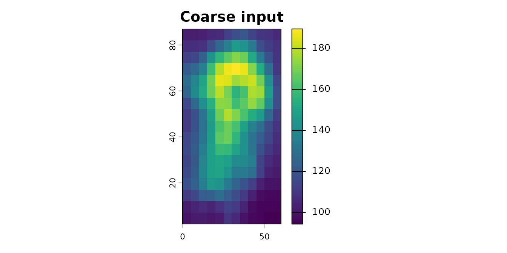
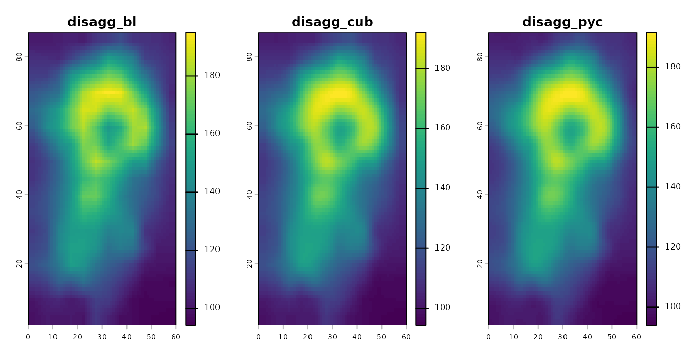

# Introduction to terraces

The `terraces` package provides aggregation-consistent disaggregation
methods for `terra` rasters. Unlike standard bilinear interpolation,
when applied to a coarse raster, these methods produce a fine-scale
result that can be re-aggregated to recover the original coarse values.
See the [README](https://matthewkling.github.io/terraces/) for
background, and the [method-comparison
article](https://matthewkling.github.io/terraces/articles/method-comparison.html)
for a more detailed exploration of how these methods work on real
elevation data.

This vignette walks through basic usage.

``` r

library(terra)
#> terra 1.9.27
library(terraces)
#> 
#> Attaching package: 'terraces'
#> The following object is masked from 'package:stats':
#> 
#>     kernel
```

## Disaggregating a coarse raster

We’ll use the `volcano` dataset that ships with base R as a coarse
input:

``` r

coarse <- rast(volcano) |> aggregate(5) |> trim()
plot(coarse, main = "Coarse input")
```



Each of the three methods takes the coarse raster and a disaggregation
factor:

``` r

fine_bl  <- disagg_bl( coarse, fact = 5) |> setNames("disagg_bl")
fine_cub <- disagg_cub(coarse, fact = 5) |> setNames("disagg_cub")
fine_pyc <- disagg_pyc(coarse, fact = 5) |> setNames("disagg_pyc")

plot(c(fine_bl, fine_cub, fine_pyc), nr = 1)
```



The three methods produce qualitatively similar output but differ in
their smoothness priors. See the README or the method-comparison article
for guidance on choosing between them.

## Mapping the boundary band

The pre-sharpening methods
([`disagg_bl()`](https://matthewkling.github.io/terraces/reference/disagg_bl.md)
and
[`disagg_cub()`](https://matthewkling.github.io/terraces/reference/disagg_cub.md))
have a small boundary band where mass preservation degrades slightly.
You can map this affected zone with
[`edge_effects()`](https://matthewkling.github.io/terraces/reference/edge_effects.md):

``` r

ee <- edge_effects(coarse, fact = 5, method = "cubic")
plot(ee, main = "Edge-effect zone (cubic method)")
```


Values 1 and 2 indicate cells affected by the pre-sharpening filter and
the boundary interpolation fallback, respectively. For studies that care
about precision near a particular region of interest, the cleanest
practical workaround is to disaggregate over a larger domain that
extends beyond the study area, then crop the result — this places the
edge effects safely outside the cells you actually use. Alternatively,
if you need exact mass preservation everywhere — for example, when
tiling mosaics or when extending the domain isn’t possible — use
[`disagg_pyc()`](https://matthewkling.github.io/terraces/reference/disagg_pyc.md),
which can be slower for large rasters but isn’t subject to these
effects.

## Verifying mass preservation

Re-aggregating the fine output should recover the original coarse
values.

To compare methods fairly, we’ll exclude the boundary band where the
pre-sharpening methods are known to have degraded accuracy. We build a
coarse-resolution mask flagging any coarse cell that contains a level-2
boundary fine cell:

``` r

coarse_mask <- aggregate(ee, 5, fun = "max")

max_error <- function(fine, coarse, mask){
      back <- aggregate(fine, fact = 5, fun = "mean")
      max(abs(values(mask(coarse - back, mask, maskvalues = 2))), na.rm = TRUE)
}
```

For
[`disagg_pyc()`](https://matthewkling.github.io/terraces/reference/disagg_pyc.md),
residuals are at machine precision — mass is preserved exactly by
construction, with or without the mask:

``` r

max_error(fine_pyc, coarse, coarse_mask)
#> [1] 8.526513e-14
```

For
[`disagg_bl()`](https://matthewkling.github.io/terraces/reference/disagg_bl.md)
and
[`disagg_cub()`](https://matthewkling.github.io/terraces/reference/disagg_cub.md),
interior residuals are very small (~6 cm on a DEM covering a 100 m
range), but are nonzero due to finite-radius kernel truncation:

``` r

max_error(fine_bl, coarse, coarse_mask)
#> [1] 0.06369263
```

For comparison, here’s the same check with standard bilinear
disaggregation using
[`terra::disagg()`](https://rspatial.github.io/terra/reference/disaggregate.html).
Residuals here are orders of magnitude larger — standard bilinear isn’t
mass-preserving:

``` r

fine_std <- terra::disagg(coarse, fact = 5, method = "bilinear")
max_error(fine_std, coarse, coarse_mask)
#> [1] 5.277122
```

## Learn more

- The [README](https://matthewkling.github.io/terraces/) explains the
  package’s design and helps you choose between methods.
- The [method-comparison
  article](https://matthewkling.github.io/terraces/articles/method-comparison.html)
  works through a detailed analysis with a real DEM, comparing methods
  based on their assumptions, accuracy, and computational speed.
- Function help:
  [`?disagg_bl`](https://matthewkling.github.io/terraces/reference/disagg_bl.md),
  [`?disagg_cub`](https://matthewkling.github.io/terraces/reference/disagg_cub.md),
  [`?disagg_pyc`](https://matthewkling.github.io/terraces/reference/disagg_pyc.md),
  [`?edge_effects`](https://matthewkling.github.io/terraces/reference/edge_effects.md).
